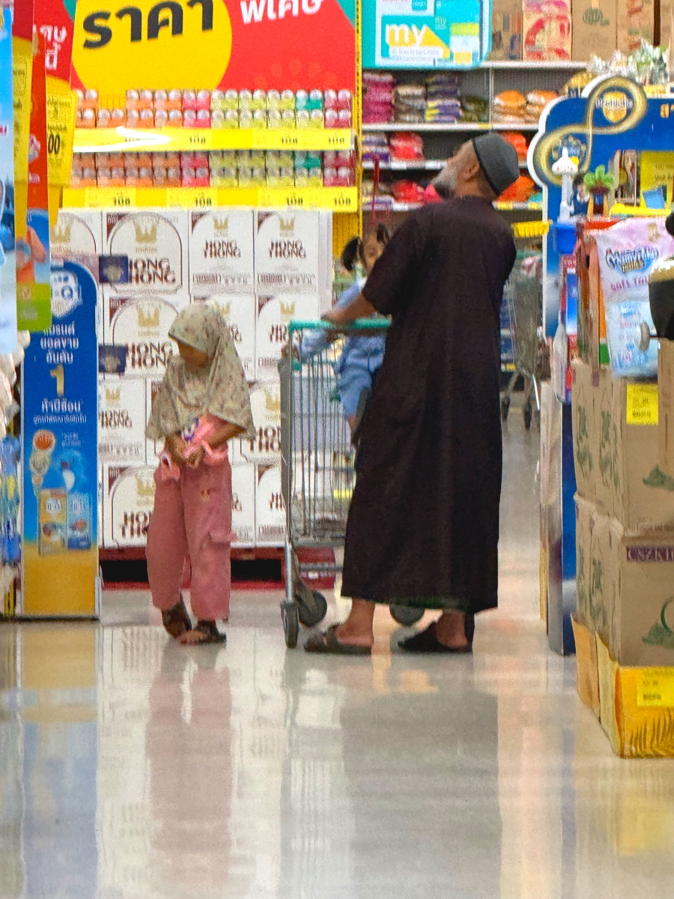

# 20241126_chiangrai

<html>
<head>

<meta charset="UTF-8">
<meta http-equiv="Content-Type" content="text/html; charset=UTF-8">
<meta http-equiv="X-UA-Compatible" content="IE=EmulateIE10" />
<meta http-equiv="X-UA-Compatible" content="IE=edge">

<!--ここから上はお決まりの定型文です-->

<!--ここからが表現の書式などを決めるcssという部分-->

<link href="https://cdnjs.cloudflare.com/ajax/libs/lightbox2/2.7.1/css/lightbox.css" rel="stylesheet">

</head>

<body>

モバイル端末をお使いの場合は、画面を横向きにすると
より見やすくご覧頂けます。

<!--ここ上は、ほぼそのまま使います！-->

<!--QRコードの挿入例-->

 アクセス用QRコード

<marquee direction="left" scrollamount="20" width="30%">(^_^)/~alis</marquee>

<!--流れ文字の挿入例-->
<h1><marquee behavior="left">!!! 2024/11/26 、メーチャンで親戚にご挨拶、その後7/11、Lotus、市場をハシゴ !!!</marquee></h1>

<!--上段にパンクズリストを入れる時の例-->

<a href="https://torokoid.github.io/20241120_bangkok/" target="_blank">2024年11月20日、宇都宮からバンコクに移動</a> ><a href="https://torokoid.github.io/20241121_bangkok/" target="_blank">11月21日、バンコク市内をうろうろ</a> ><a href="https://torokoid.github.io/20241122_chiangrai/" target="_blank">11月22日、バンコク市内をうろついてからChaing Raiに移動</a> ><a href="https://torokoid.github.io/20241123_chiangrai/" target="_blank">11月23日、チェンライのショッピンセンターでお買い物して、午後は親戚のお葬式</a> ><a href="https://torokoid.github.io/20241124_chiangrai/" target="_blank">11月24日 、チェンライ3日目は, 朝市で朝ごはん調達</a> ><a href="https://torokoid.github.io/20241125_chiangrai/" target="_blank">11月25日 、チェンライの平穏な1日を記録</a> ><a>11月26日 、メーチャンで親戚を訪問</a>  ><a href="https://torokoid.github.io/20241129_KunFhone_Wedding/" target="_blank">11月29日 、親戚がドイツ人と結婚したので披露宴に出席</a> ><a href="https://torokoid.github.io/20241130_chiangrai/" target="_blank">11月30日 、チェンライ近郊にスイミングプール見つけました</a> ><a href="https://torokoid.github.io/20241202_chiangrai/" target="_blank">2024/11/29〜12/02 、チェンライ近郊の散策状況</a> ><a href="https://torokoid.github.io/20241204_chiangrai/" target="_blank">2024/12/03〜12/04 、チェンライで過ごす日々のまとめ</a>

                          

<!--ここから下が、本体部分-->

<h2>ちょっと早起きして、ヤシの木の向こうの朝日を拝みます</h2>

<h2>植物の勢いはすごいので、雑草のお手入れは人力では追いつかず！</h2>

<h2>お花たちは咲き誇っています</h2>

<h2>チェンライの北の町メーチャンで親戚を訪問</h2>

<h2>お昼を頂きました</h2>

<h2>缶ジュースにもタイ語の説明</h2>

<h2>訪問先は、先日の故人の長女夫婦のところ</h2>

<h2>同じ敷地で、ご長男が弁護士事務所を開設しています</h2>

<h2>メーチャン役場の前にあるロータリー内の仏壇は、お寺サイズでした！</h2>

<h2>Lotusで買い物すると目がいってしまうイスラム教のご家族 気にしちゃうのは日本人の私だけかも？</h2>

<h2>このサイズのお寺は頻繁に目にします この2枚は別のお寺</h2>

<h2>7/11は結構あるので、ここで手堅くお菓子など調達</h2>

<h2>前の国道を行き交うバイク、日本製スクーターが大活躍です</h2>

<h2>市場のお店に、手作り的な神様が祀られていました</h2>

<h2>基本は朝市なので、午後には商品が品切れ気味</h2>

<h2>神様が祀られていたお店から声が掛かって、見てみると噴水が作動</h2>

<h2>日本人が写真撮ったのを見て、店主のおじさんが水を出してくれました</h2>

<h2>1日の最後は、懸案だったアマチュア無線のデジタル通信</h2>

<h2>無線機に小さなPCを繋いで、インターネット経由で通信します</h2>

<h2>PCがネットに入れず苦労してましたが、１週間目にしてやっとネットイン</h2>

<h2>早速横浜の局と交信できました。通信状態は「メリット５」（アナログ通信の59に相当）</h2>

  

<h2>無線機がデジタル化した時点で、多彩な通信方法が開発されています。 今回使ったのは下記リンク先に説明されている４手法のうちの一つ「ポータブルデジタルノード」 
<a href="https://www.yaesu.com/jp/amateur_index/download/1908_Portable_Node_web.pdf" target="_blank">YAESUのHPにあるデジタル通信の説明書リンク</a></h2>

   

   

   

         

  

      

<!--本体はここまで-->

<!--画面に空白地帯を作って、背景が見えるようにしています-->
                                              

<!-- フッタ -->
<footer>

Copyright 2024/11/26 alis @ChiangRai

</footer>

<!--HPにさまざまなJavaScriptを呼び込むための書式-->

